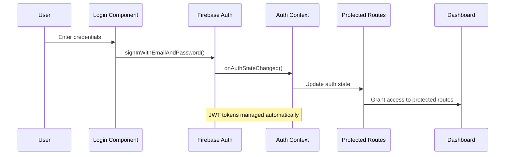

# Authentication Architecture - Firebase Auth Implementation

## Overview

This document outlines the implementation of Firebase Authentication for Phase 2, providing secure access to the employee management system without the complexity of email verification or SMTP services.

## Architecture Design

### Authentication Flow


### Component Architecture
```
src/
├── contexts/
│   └── AuthContext.tsx          # Global auth state management
├── components/
│   ├── auth/
│   │   ├── LoginForm.tsx        # Login form component
│   │   ├── ProtectedRoute.tsx   # Route protection wrapper
│   │   └── UnauthorizedPage.tsx # Custom 404 for auth
│   └── layout/
│       ├── Header.tsx           # Updated with logout
│       └── Sidebar.tsx          # Updated with user info
├── hooks/
│   └── useAuth.tsx              # Authentication hook
└── services/
    └── auth.ts                  # Firebase auth operations
```

## Implementation Specifications

### 1. Firebase Auth Configuration

#### Environment Variables (add to .env)
```bash
# Firebase Auth (same config as existing Firestore)
REACT_APP_FIREBASE_API_KEY=your_api_key
REACT_APP_FIREBASE_AUTH_DOMAIN=your_project.firebaseapp.com
# ... existing Firebase variables
```

#### Firebase Auth Service (`src/services/auth.ts`)
```typescript
import { 
  Auth, 
  signInWithEmailAndPassword,
  signOut,
  onAuthStateChanged,
  User
} from 'firebase/auth';
import { auth } from './firebase'; // Extend existing firebase.ts

export interface AuthError {
  code: string;
  message: string;
  userFriendlyMessage: string;
}

export const authService = {
  // Sign in with email/password
  signIn: async (email: string, password: string): Promise<User> => {
    try {
      const userCredential = await signInWithEmailAndPassword(auth, email, password);
      return userCredential.user;
    } catch (error: any) {
      throw handleAuthError(error);
    }
  },

  // Sign out
  signOut: async (): Promise<void> => {
    try {
      await signOut(auth);
      // Clear any local storage data
      localStorage.removeItem('formData');
      sessionStorage.clear();
    } catch (error: any) {
      throw handleAuthError(error);
    }
  },

  // Get current user
  getCurrentUser: (): User | null => {
    return auth.currentUser;
  },

  // Subscribe to auth state changes
  onAuthStateChanged: (callback: (user: User | null) => void) => {
    return onAuthStateChanged(auth, callback);
  }
};

// Firebase Auth error handling
const handleAuthError = (error: any): AuthError => {
  let userFriendlyMessage = 'Ocorreu um erro durante a autenticação.';
  
  switch (error.code) {
    case 'auth/invalid-email':
      userFriendlyMessage = 'E-mail inválido.';
      break;
    case 'auth/user-disabled':
      userFriendlyMessage = 'Esta conta foi desabilitada.';
      break;
    case 'auth/user-not-found':
      userFriendlyMessage = 'Usuário não encontrado.';
      break;
    case 'auth/wrong-password':
      userFriendlyMessage = 'Senha incorreta.';
      break;
    case 'auth/too-many-requests':
      userFriendlyMessage = 'Muitas tentativas. Tente novamente mais tarde.';
      break;
    case 'auth/network-request-failed':
      userFriendlyMessage = 'Erro de conexão. Verifique sua internet.';
      break;
    default:
      userFriendlyMessage = 'Erro de autenticação. Tente novamente.';
  }

  return {
    code: error.code,
    message: error.message,
    userFriendlyMessage
  };
};
```

### 2. Authentication Context

#### Auth Context (`src/contexts/AuthContext.tsx`)
```typescript
import React, { createContext, useContext, useEffect, useState } from 'react';
import { User } from 'firebase/auth';
import { authService } from '../services/auth';

interface AuthState {
  user: User | null;
  loading: boolean;
  error: string | null;
}

interface AuthContextType extends AuthState {
  signIn: (email: string, password: string) => Promise<void>;
  signOut: () => Promise<void>;
  clearError: () => void;
}

const AuthContext = createContext<AuthContextType | undefined>(undefined);

export const useAuth = () => {
  const context = useContext(AuthContext);
  if (context === undefined) {
    throw new Error('useAuth must be used within an AuthProvider');
  }
  return context;
};

export const AuthProvider: React.FC<{ children: React.ReactNode }> = ({ children }) => {
  const [state, setState] = useState<AuthState>({
    user: null,
    loading: true,
    error: null
  });

  useEffect(() => {
    const unsubscribe = authService.onAuthStateChanged((user) => {
      setState(prev => ({
        ...prev,
        user,
        loading: false
      }));
    });

    return unsubscribe;
  }, []);

  const signIn = async (email: string, password: string) => {
    setState(prev => ({ ...prev, loading: true, error: null }));
    
    try {
      await authService.signIn(email, password);
      // User state will be updated by onAuthStateChanged
    } catch (error: any) {
      setState(prev => ({
        ...prev,
        loading: false,
        error: error.userFriendlyMessage || 'Erro na autenticação'
      }));
    }
  };

  const signOut = async () => {
    setState(prev => ({ ...prev, loading: true, error: null }));
    
    try {
      await authService.signOut();
      // User state will be updated by onAuthStateChanged
    } catch (error: any) {
      setState(prev => ({
        ...prev,
        loading: false,
        error: 'Erro ao sair da conta'
      }));
    }
  };

  const clearError = () => {
    setState(prev => ({ ...prev, error: null }));
  };

  const value: AuthContextType = {
    ...state,
    signIn,
    signOut,
    clearError
  };

  return (
    <AuthContext.Provider value={value}>
      {children}
    </AuthContext.Provider>
  );
};
```

### 3. UI Components

#### Login Form (`src/components/auth/LoginForm.tsx`)
```typescript
import React, { useState } from 'react';
import {
  Box,
  Paper,
  TextField,
  Button,
  Typography,
  Alert,
  CircularProgress,
  useTheme
} from '@mui/material';
import { useAuth } from '../../contexts/AuthContext';

const LoginForm: React.FC = () => {
  const theme = useTheme();
  const { signIn, loading, error, clearError } = useAuth();
  const [formData, setFormData] = useState({
    email: '',
    password: ''
  });
  const [formErrors, setFormErrors] = useState<Record<string, string>>({});

  const validateForm = (): boolean => {
    const errors: Record<string, string> = {};
    
    if (!formData.email) {
      errors.email = 'E-mail é obrigatório';
    } else if (!/^[^\s@]+@[^\s@]+\.[^\s@]+$/.test(formData.email)) {
      errors.email = 'E-mail deve ter um formato válido';
    }
    
    if (!formData.password) {
      errors.password = 'Senha é obrigatória';
    } else if (formData.password.length < 6) {
      errors.password = 'Senha deve ter pelo menos 6 caracteres';
    }
    
    setFormErrors(errors);
    return Object.keys(errors).length === 0;
  };

  const handleSubmit = async (e: React.FormEvent) => {
    e.preventDefault();
    clearError();
    
    if (validateForm()) {
      await signIn(formData.email, formData.password);
    }
  };

  const handleChange = (field: string) => (e: React.ChangeEvent<HTMLInputElement>) => {
    setFormData(prev => ({
      ...prev,
      [field]: e.target.value
    }));
    
    // Clear field error when user starts typing
    if (formErrors[field]) {
      setFormErrors(prev => ({
        ...prev,
        [field]: ''
      }));
    }
  };

  return (
    <Box
      sx={{
        display: 'flex',
        justifyContent: 'center',
        alignItems: 'center',
        minHeight: '100vh',
        backgroundColor: theme.palette.background.default,
        padding: theme.spacing(2)
      }}
    >
      <Paper
        elevation={3}
        sx={{
          padding: theme.spacing(4),
          maxWidth: 400,
          width: '100%',
          borderRadius: '12px'
        }}
      >
        <Box sx={{ textAlign: 'center', marginBottom: theme.spacing(3) }}>
          <Typography
            variant="h4"
            component="h1"
            sx={{
              fontWeight: 600,
              color: theme.palette.text.primary,
              marginBottom: theme.spacing(1)
            }}
          >
            Login
          </Typography>
          <Typography
            variant="body2"
            color="text.secondary"
          >
            Entre com suas credenciais para acessar o sistema
          </Typography>
        </Box>

        {error && (
          <Alert 
            severity="error" 
            sx={{ marginBottom: theme.spacing(2) }}
            onClose={clearError}
          >
            {error}
          </Alert>
        )}

        <form onSubmit={handleSubmit}>
          <TextField
            fullWidth
            label="E-mail"
            type="email"
            value={formData.email}
            onChange={handleChange('email')}
            error={!!formErrors.email}
            helperText={formErrors.email}
            margin="normal"
            variant="outlined"
            autoComplete="email"
            autoFocus
          />
          
          <TextField
            fullWidth
            label="Senha"
            type="password"
            value={formData.password}
            onChange={handleChange('password')}
            error={!!formErrors.password}
            helperText={formErrors.password}
            margin="normal"
            variant="outlined"
            autoComplete="current-password"
          />

          <Button
            type="submit"
            fullWidth
            variant="contained"
            disabled={loading}
            sx={{
              marginTop: theme.spacing(3),
              padding: theme.spacing(1.5),
              borderRadius: '8px',
              backgroundColor: theme.palette.primary.main,
              '&:hover': {
                backgroundColor: theme.palette.primary.dark,
              }
            }}
          >
            {loading ? (
              <CircularProgress size={24} color="inherit" />
            ) : (
              'Entrar'
            )}
          </Button>
        </form>
      </Paper>
    </Box>
  );
};

export default LoginForm;
```

#### Protected Route Wrapper (`src/components/auth/ProtectedRoute.tsx`)
```typescript
import React from 'react';
import { Navigate } from 'react-router-dom';
import { Box, CircularProgress } from '@mui/material';
import { useAuth } from '../../contexts/AuthContext';

interface ProtectedRouteProps {
  children: React.ReactNode;
  fallback?: React.ReactNode;
}

const ProtectedRoute: React.FC<ProtectedRouteProps> = ({ 
  children, 
  fallback = <Navigate to="/login" replace /> 
}) => {
  const { user, loading } = useAuth();

  // Show loading spinner while checking authentication
  if (loading) {
    return (
      <Box
        sx={{
          display: 'flex',
          justifyContent: 'center',
          alignItems: 'center',
          minHeight: '100vh'
        }}
      >
        <CircularProgress />
      </Box>
    );
  }

  // Redirect to login if not authenticated
  if (!user) {
    return <>{fallback}</>;
  }

  // User is authenticated, render protected content
  return <>{children}</>;
};

export default ProtectedRoute;
```

#### Unauthorized Page (`src/components/auth/UnauthorizedPage.tsx`)
```typescript
import React from 'react';
import {
  Box,
  Typography,
  Button,
  useTheme
} from '@mui/material';
import { useNavigate } from 'react-router-dom';
import LockOutlinedIcon from '@mui/icons-material/LockOutlined';

const UnauthorizedPage: React.FC = () => {
  const theme = useTheme();
  const navigate = useNavigate();

  const handleBackToLogin = () => {
    navigate('/login');
  };

  return (
    <Box
      sx={{
        display: 'flex',
        flexDirection: 'column',
        justifyContent: 'center',
        alignItems: 'center',
        minHeight: '100vh',
        backgroundColor: theme.palette.background.default,
        padding: theme.spacing(2),
        textAlign: 'center'
      }}
    >
      <Box
        sx={{
          backgroundColor: theme.palette.error.light,
          borderRadius: '50%',
          padding: theme.spacing(3),
          marginBottom: theme.spacing(3)
        }}
      >
        <LockOutlinedIcon
          sx={{
            fontSize: '4rem',
            color: theme.palette.error.main
          }}
        />
      </Box>

      <Typography
        variant="h1"
        sx={{
          fontSize: '6rem',
          fontWeight: 700,
          color: theme.palette.error.main,
          marginBottom: theme.spacing(1)
        }}
      >
        401
      </Typography>

      <Typography
        variant="h4"
        sx={{
          fontWeight: 600,
          color: theme.palette.text.primary,
          marginBottom: theme.spacing(2)
        }}
      >
        Acesso Não Autorizado
      </Typography>

      <Typography
        variant="body1"
        color="text.secondary"
        sx={{ marginBottom: theme.spacing(4), maxWidth: 400 }}
      >
        Você não tem permissão para acessar esta página. 
        Por favor, faça login com uma conta válida.
      </Typography>

      <Button
        variant="contained"
        onClick={handleBackToLogin}
        sx={{
          padding: theme.spacing(1.5, 4),
          borderRadius: '8px',
          backgroundColor: theme.palette.primary.main,
          '&:hover': {
            backgroundColor: theme.palette.primary.dark,
          }
        }}
      >
        Ir para Login
      </Button>
    </Box>
  );
};

export default UnauthorizedPage;
```

### 4. App Integration

#### Updated App.tsx Structure
```typescript
import React from 'react';
import { BrowserRouter as Router, Routes, Route, Navigate } from 'react-router-dom';
import { ThemeProvider } from '@mui/material/styles';
import { CssBaseline } from '@mui/material';
import theme from './theme';
import { AuthProvider } from './contexts/AuthContext';
import ProtectedRoute from './components/auth/ProtectedRoute';
import LoginForm from './components/auth/LoginForm';
import UnauthorizedPage from './components/auth/UnauthorizedPage';
import DashboardApp from './DashboardApp'; // Existing app content

function App() {
  return (
    <ThemeProvider theme={theme}>
      <CssBaseline />
      <AuthProvider>
        <Router>
          <Routes>
            {/* Public routes */}
            <Route path="/login" element={<LoginForm />} />
            <Route path="/unauthorized" element={<UnauthorizedPage />} />
            
            {/* Protected routes */}
            <Route 
              path="/*" 
              element={
                <ProtectedRoute fallback={<Navigate to="/unauthorized" replace />}>
                  <DashboardApp />
                </ProtectedRoute>
              } 
            />
            
            {/* Default redirect */}
            <Route path="/" element={<Navigate to="/colaboradores" replace />} />
          </Routes>
        </Router>
      </AuthProvider>
    </ThemeProvider>
  );
}

export default App;
```

### 5. Updated Layout Components

#### Header with Logout (`src/components/layout/Header.tsx`)
```typescript
// Add to existing Header component
import { useAuth } from '../../contexts/AuthContext';
import { IconButton, Menu, MenuItem, Avatar } from '@mui/material';
import LogoutIcon from '@mui/icons-material/Logout';
import PersonIcon from '@mui/icons-material/Person';

// Inside Header component:
const { user, signOut } = useAuth();
const [anchorEl, setAnchorEl] = useState<null | HTMLElement>(null);

const handleUserMenuClick = (event: React.MouseEvent<HTMLElement>) => {
  setAnchorEl(event.currentTarget);
};

const handleUserMenuClose = () => {
  setAnchorEl(null);
};

const handleLogout = async () => {
  handleUserMenuClose();
  await signOut();
};

// Add to header JSX:
<IconButton onClick={handleUserMenuClick}>
  <Avatar sx={{ width: 32, height: 32 }}>
    <PersonIcon />
  </Avatar>
</IconButton>

<Menu
  anchorEl={anchorEl}
  open={Boolean(anchorEl)}
  onClose={handleUserMenuClose}
>
  <MenuItem disabled>
    {user?.email}
  </MenuItem>
  <MenuItem onClick={handleLogout}>
    <LogoutIcon fontSize="small" sx={{ mr: 1 }} />
    Sair
  </MenuItem>
</Menu>
```

## Firebase Security Rules

### Auth-Based Security Rules (update `firestore.rules`)
```javascript
rules_version = '2';
service cloud.firestore {
  match /databases/{database}/documents {
    // Helper functions
    function isAuthenticated() {
      return request.auth != null;
    }
    
    function isValidUser() {
      return isAuthenticated() && 
             request.auth.token.email_verified == true;
    }

    // Employees collection - require authentication
    match /employees/{employeeId} {
      allow read, write: if isAuthenticated();
    }
    
    // Departments collection - require authentication  
    match /departments/{departmentId} {
      allow read, write: if isAuthenticated();
    }
    
    // Users collection - for user profile management
    match /users/{userId} {
      allow read, write: if isAuthenticated() && 
                            request.auth.uid == userId;
    }
  }
}
```

## Testing Strategy

### Authentication Tests (`tests/auth/`)
```typescript
// tests/auth/login.spec.ts
test.describe('Authentication', () => {
  test('should login with valid credentials', async ({ page }) => {
    await page.goto('/login');
    await page.fill('[data-testid="email-input"]', 'test@example.com');
    await page.fill('[data-testid="password-input"]', 'password123');
    await page.click('[data-testid="login-button"]');
    
    // Should redirect to dashboard
    await expect(page).toHaveURL('/colaboradores');
  });
  
  test('should show error for invalid credentials', async ({ page }) => {
    await page.goto('/login');
    await page.fill('[data-testid="email-input"]', 'invalid@example.com');
    await page.fill('[data-testid="password-input"]', 'wrongpassword');
    await page.click('[data-testid="login-button"]');
    
    // Should show error message
    await expect(page.locator('.MuiAlert-root')).toBeVisible();
  });
  
  test('should protect routes when not authenticated', async ({ page }) => {
    await page.goto('/colaboradores');
    
    // Should redirect to unauthorized page
    await expect(page).toHaveURL('/unauthorized');
  });
});
```

## Implementation Checklist

- [ ] Install React Router DOM for routing
- [ ] Configure Firebase Auth in existing firebase.ts
- [ ] Create auth service with error handling
- [ ] Implement AuthContext and AuthProvider
- [ ] Create LoginForm component with validation
- [ ] Create ProtectedRoute wrapper
- [ ] Create UnauthorizedPage component
- [ ] Update App.tsx with routing
- [ ] Update Header with logout functionality
- [ ] Update Sidebar with user information
- [ ] Configure Firebase Security Rules
- [ ] Create authentication tests
- [ ] Test route protection
- [ ] Test login/logout flow
- [ ] Verify error handling

## Security Best Practices

1. **Token Management**: Firebase handles JWT tokens automatically
2. **Route Protection**: All application routes require authentication
3. **Session Persistence**: Firebase Auth persists sessions across browser refreshes
4. **Error Handling**: User-friendly error messages without exposing system details
5. **Logout Cleanup**: Clear all local data on logout
6. **Input Validation**: Validate email format and password requirements
7. **Security Rules**: Firestore rules require authentication for all operations

This architecture provides secure, scalable authentication without unnecessary complexity, maintaining the project's showcase-focused approach while ensuring proper access control.