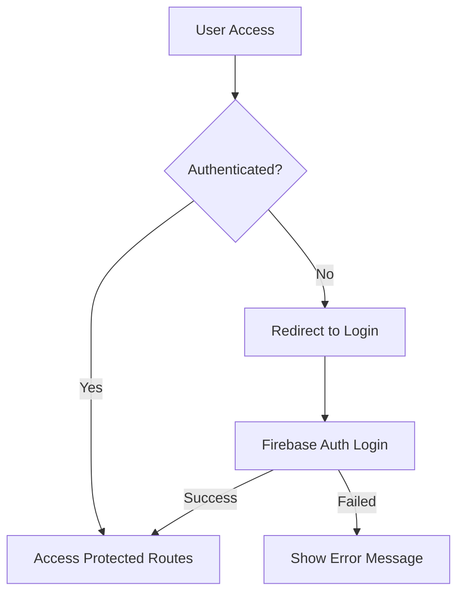
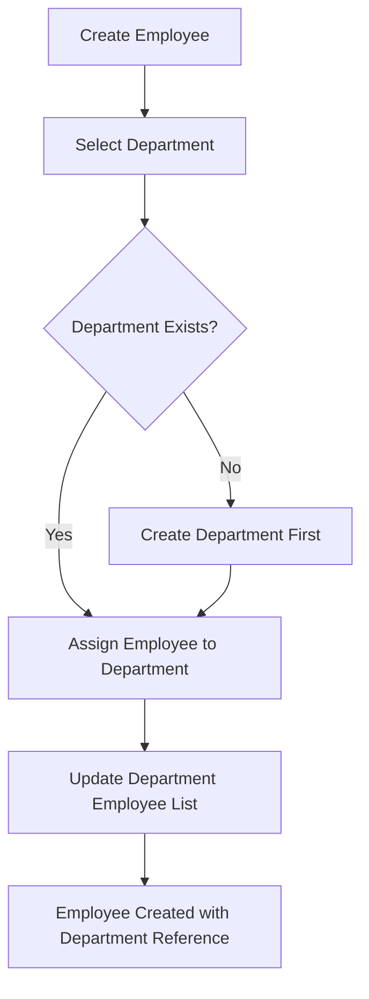

# Phase 2 Requirements - Authentication & Management System

## Project Phase Overview

**Branch**: `feature/auth-and-management-system`  
**Based on**: SecondStep.md requirements  
**Current Status**: Phase 1 Complete (Multi-step employee registration with 4 fields)

## Existing Features (Phase 1 - Completed ✅)

### Current Implementation Status
- ✅ **Multi-step Employee Registration**: 2-step form (Personal Info → Professional Info)
- ✅ **Employee CRUD Operations**: Create, Read, Update, Delete (individual and bulk)
- ✅ **Employee Display Table**: Sortable columns, hover actions, delete mode
- ✅ **Firebase Integration**: Firestore persistence, security rules, error handling
- ✅ **Material UI Design**: Consistent styling, responsive layout, accessibility
- ✅ **Comprehensive Testing**: Playwright E2E tests with security validation

### Current Employee Data Model
```typescript
interface PersonalInfo {
  firstName: string;
  email: string;
  activateOnCreate: boolean;
}

interface ProfessionalInfo {
  department: string; // Selected from predefined list
}
```

## Phase 2 New Requirements

Based on SecondStep.md specifications:

### 1. Authentication System 🔐

#### Core Requirements
- **Firebase Authentication** with JWT token management
- **Login Screen** with email/password authentication
- **Route Protection** for existing application pages
- **Custom 404 Page** for unauthorized access attempts
- **Session Management** with Firebase Auth state persistence

#### Implementation Scope
- ❌ **No Email Verification**: Keep authentication simple for showcase
- ❌ **No SMTP/Email Server**: Avoid complexity overhead
- ❌ **No Password Recovery Flow**: Focus on core functionality
- ✅ **Basic Login/Logout**: Simple, effective authentication

#### Technical Specifications
```typescript
// Authentication State Management
interface AuthState {
  user: User | null;
  loading: boolean;
  error: string | null;
}

// Protected Route Pattern
interface ProtectedRouteProps {
  children: React.ReactNode;
  fallback?: React.ReactNode;
}
```

### 2. Enhanced Employee Management 👥

#### Search & Filtering (New Feature)
Based on SecondStep.md: *"search filters by name, email, and department must be added"*

- **Search Fields**: Name, Email, Department filtering
- **Real-time Search**: Filter as user types
- **Combined Filters**: Multiple criteria simultaneously
- **Clear Filters**: Reset to show all employees

#### Extended Employee Form Fields (New Feature)
Based on SecondStep.md professional information additions:

```typescript
// Extended Professional Info
interface ExtendedProfessionalInfo {
  department: string; // Existing field
  position: string; // New: Job position/title
  admissionDate: string; // New: Date started (ISO format)
  hierarchicalLevel: 'junior' | 'mid-level' | 'senior' | 'manager'; // New
  responsibleManager?: string; // New: Employee ID of manager (optional for non-manager levels)
  baseSalary: number; // New: Base salary amount
}
```

#### Manager-Employee Relationship Rules
- **Manager Selection**: Only employees with `hierarchicalLevel: 'manager'` can be selected as responsible managers
- **Hierarchy Validation**: Employees cannot be their own managers
- **Manager Requirement**: Only non-manager levels require a responsible manager

### 3. Department Management System 🏢

#### New Department Entity
Based on SecondStep.md: *"create a department listing page, similar to the employee one"*

```typescript
interface Department {
  id: string;
  name: string;
  employees: string[]; // Array of employee IDs
  responsibleManager: string; // Employee ID with manager level
  createdAt: Date;
  updatedAt: Date;
}
```

#### Department CRUD Operations
- **Department Listing Page**: Similar layout to employee table
- **Create Department**: Form with name, manager selection
- **Edit Department**: Modify name, change manager, manage employee list
- **Delete Department**: With employee reassignment validation
- **Employee Management**: Add/remove employees from departments

#### Department-Employee Relationships
- **Required Department**: Every employee MUST belong to a department
- **Department Transfer**: Move employees between departments via employee editing
- **Manager Assignment**: Department responsible manager must be an employee with manager-level hierarchy
- **Cascade Updates**: Department changes reflect in employee records

### 4. Data Model Updates 📊

#### Firebase Collections Structure
```typescript
// employees collection (extended)
interface FirebaseEmployee {
  id: string;
  personalInfo: PersonalInfo; // Unchanged
  professionalInfo: ExtendedProfessionalInfo; // Extended
  departmentId: string; // Reference to department
  status: 'Ativo' | 'Inativo';
  avatar: string;
  createdAt: Timestamp;
  updatedAt: Timestamp;
}

// departments collection (new)
interface FirebaseDepartment {
  id: string;
  name: string;
  responsibleManagerId: string; // Employee reference
  employeeIds: string[]; // Employee references
  createdAt: Timestamp;
  updatedAt: Timestamp;
}

// users collection (new - for authentication)
interface FirebaseUser {
  uid: string;
  email: string;
  role: 'admin' | 'user'; // Basic role system
  createdAt: Timestamp;
}
```

## Technical Implementation Requirements

### Authentication Flow


### Department-Employee Relationship Flow


## Form Validation Rules

### Authentication
- **Email**: Required, valid email format
- **Password**: Required, minimum 6 characters (Firebase default)

### Extended Employee Fields
- **Position**: Required, string, max 100 characters
- **Admission Date**: Required, valid date, cannot be future date
- **Hierarchical Level**: Required, one of enum values
- **Responsible Manager**: Required for non-manager levels, must be manager-level employee
- **Base Salary**: Required, positive number, reasonable range (1000-1000000)

### Department Fields
- **Name**: Required, unique, string, max 100 characters
- **Responsible Manager**: Required, must be manager-level employee
- **Employees**: Optional initially, managed through assignment interface

## Security Considerations

### Firebase Security Rules Extensions
```javascript
// Extended employee validation
function isValidEmployeeData(data) {
  return data.keys().hasAll(['personalInfo', 'professionalInfo', 'departmentId']) &&
         isValidProfessionalInfo(data.professionalInfo) &&
         isValidDepartmentReference(data.departmentId);
}

// Department security rules
function isValidDepartmentData(data) {
  return data.keys().hasAll(['name', 'responsibleManagerId']) &&
         data.name is string &&
         data.name.size() > 0 &&
         data.name.size() <= 100 &&
         isManagerEmployee(data.responsibleManagerId);
}
```

### Authentication Security
- **Route Protection**: All application routes require authentication
- **Role-based Access**: Basic admin/user role system
- **Session Management**: Firebase Auth automatic token refresh
- **Logout Cleanup**: Clear local storage and redirect to login

## Testing Strategy Extensions

### New Test Scenarios
1. **Authentication Tests**
   - Login with valid/invalid credentials
   - Route protection verification
   - Session persistence across page refreshes
   - Logout functionality

2. **Extended Form Tests**
   - New field validation (position, salary, admission date)
   - Manager selection filtering
   - Hierarchical level requirements

3. **Department Management Tests**
   - Department CRUD operations
   - Employee-department assignments
   - Manager validation rules

4. **Search & Filter Tests**
   - Multi-field search functionality
   - Filter combinations
   - Real-time search performance

### Playwright Test Extensions
```typescript
// Extended test data factory
interface ExtendedTestEmployeeData {
  firstName: string;
  email: string;
  activateOnCreate: boolean;
  department: string;
  position: string;
  admissionDate: string;
  hierarchicalLevel: 'junior' | 'mid-level' | 'senior' | 'manager';
  responsibleManager?: string;
  baseSalary: number;
}
```

## UI/UX Design Requirements

### Design Consistency
- **Reuse Existing Components**: Leverage current Material UI theme and components
- **Table Patterns**: Department table follows employee table design patterns
- **Form Patterns**: Extended forms maintain current 2-step structure
- **Loading States**: Consistent loading indicators and error handling

### New UI Components
- **Login Screen**: Simple, clean design matching current theme
- **Search Bar**: Integrated into employee table header
- **Department Table**: Similar to employee table with appropriate columns
- **Manager Selection**: Filtered dropdown showing only manager-level employees
- **Salary Input**: Formatted number input with currency display

## Performance Considerations

### Firebase Optimization
- **Indexed Queries**: Create indexes for search functionality
- **Batch Operations**: Group related Firestore operations
- **Lazy Loading**: Load departments/employees on demand
- **Caching Strategy**: Cache frequently accessed data

### Free Tier Compliance
- **Query Optimization**: Minimize document reads
- **Data Structure**: Efficient document organization
- **Monitoring**: Track usage against free tier limits

## Migration Strategy

### Data Migration (if needed)
- **Existing Employees**: Add default values for new fields
- **Department Assignment**: Create default departments for existing employees
- **Backward Compatibility**: Ensure existing functionality continues working

### Deployment Strategy
- **Feature Flags**: Gradual rollout of new features
- **Database Migration**: Scripts for data structure updates
- **Testing Pipeline**: Extended test coverage before deployment

## Success Criteria

### Functional Requirements
- ✅ User can login/logout with email/password
- ✅ All routes are protected and redirect unauthorized users
- ✅ Employees can be searched by name, email, and department
- ✅ Employee forms include all new professional fields
- ✅ Departments can be created, edited, and deleted
- ✅ Employee-department relationships are properly managed
- ✅ Manager selection is filtered to manager-level employees only

### Technical Requirements
- ✅ All existing tests continue to pass
- ✅ New features have comprehensive test coverage
- ✅ Firebase free tier limits are respected
- ✅ Performance remains acceptable with extended data
- ✅ Security rules properly validate all new data

### User Experience Requirements
- ✅ Design consistency maintained across new features
- ✅ Loading states and error handling work correctly
- ✅ Forms provide clear validation feedback
- ✅ Tables are sortable and searchable intuitively

---

**Implementation Note**: This requirements document serves as the foundation for Phase 2 development. Each feature should be implemented incrementally with comprehensive testing before moving to the next component.